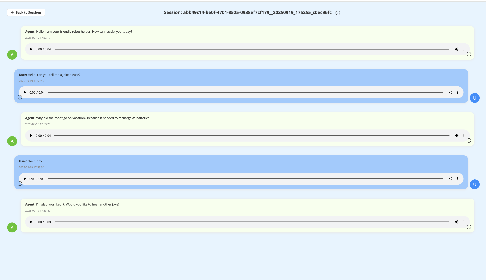
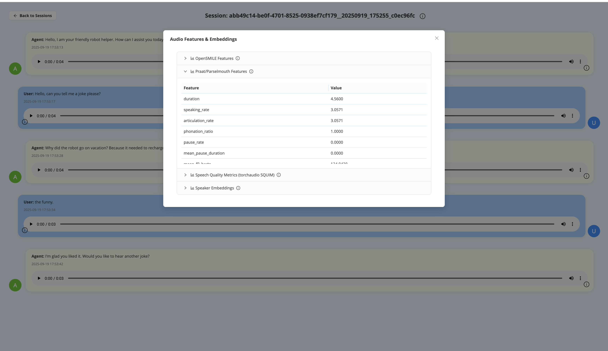

# Riverst


## Do you need/want to...

- build interactive user-avatar experiences (speech-based, with video/multimodal support)?
- collect high-quality conversational data for research or industry projects?
- automatically analyze conversations for behavioral, linguistic, or engagement metrics?

| Session overview | Automated analysis summary |
|---|---|
|  |  |

**If so, Riverst is for you.**

---

## What is Riverst?

Riverst is a platform for building, running, and analyzing interactive user-avatar conversations. It enables you to:

- Create engaging, speech-driven (and optionally multimodal) avatar interactions.
- Use these interactions for real-time applications, data collection, or research studies.
- Automatically process and analyze collected conversations with built-in pipelines (leveraging [senselab](https://github.com/sensein/senselab)) for behavioral and speech analysis.

---

## How it works

1. **User interacts with an avatar** (primarily via speech, with optional video/multimodal input).
2. **Conversations are recorded and stored** for later review or analysis.
3. **Automated pipelines** process the data, extracting features and generating insights (e.g., speech metrics, behavioral markers).
4. **Results can be used** for research, product feedback, or to power adaptive experiences.

---

## Project Structure

```
src/
├── server/              # Bot server implementation (FastAPI)
│   ├── main.py          # Server entrypoint
│   └── requirements.txt
└── flow-builder/        # Complex conversational flow/tree builder
└── client/              # Client implementations
    └── react/           # React web client
        └── index.html   # Client main page

```

---

## Requirements

- Python 3.11+
- Node.js 16+ (for React client)
- API keys for 3rd party services (see .env.example files in both client and server)
- Modern web browser with WebRTC support (e.g., Chrome 134+)

---

## Getting Started

### 1. Clone the repository

```bash
git clone https://github.com/sensein/riverst.git
cd riverst
```

### 2. Set up environment variables

- In `src/server/`, rename [`.env.example`](src/server/env.example) to `.env` and fill in the required API keys and configuration
- In `src/client/react/`, rename [`.env.example`](src/client/react/env.example) to `.env` and fill in the required API keys and configuration

**Note**: Not all API KEYS are strictly required. Only if you want to use a remote service, you need to expose the corresponding API KEY

### 3. Run

#### 3a. Run with Docker

```bash
docker compose up --build
```

#### 3b. Run manually in two different tabs of your terminal

- **Start the server:**
  ```bash
  cd src/server
  conda create -n riverst python=3.11
  conda activate riverst
  pip install -r requirements.txt
  python main.py
  ```

- **Start the client:**
  ```bash
  cd src/client/react
  npm install
  npm run dev
  ```

⚠️ **Note:** The server must be running before starting the client.

ℹ️ **Note 2:** For AWS EC2 deployment instructions, see [here](notes/first_steps_to_deploy.md).

---

## 🙏 Acknowledgments

Riverst builds on the work of these fantastic open-source projects:

- **[TalkingHead](https://github.com/met4citizen/TalkingHead)** — WebGL/Three.js talking-head renderer for avatar animation.
- **[Contextless Phonemes (CUPE)](https://github.com/tabahi/contexless-phonemes-CUPE)** — Efficient phoneme modeling utilities.
- **[Pipecat](https://github.com/pipecat-ai/pipecat)** — Real-time, multimodal agent framework for low-latency streaming.
- **[senselab](https://github.com/sensein/senselab)** — Python package for speech processing, feature extraction, and behavioral analysis.

---

## Project board

The project is in continuous progress. Follow [the project plan here](https://github.com/orgs/sensein/projects/55).
